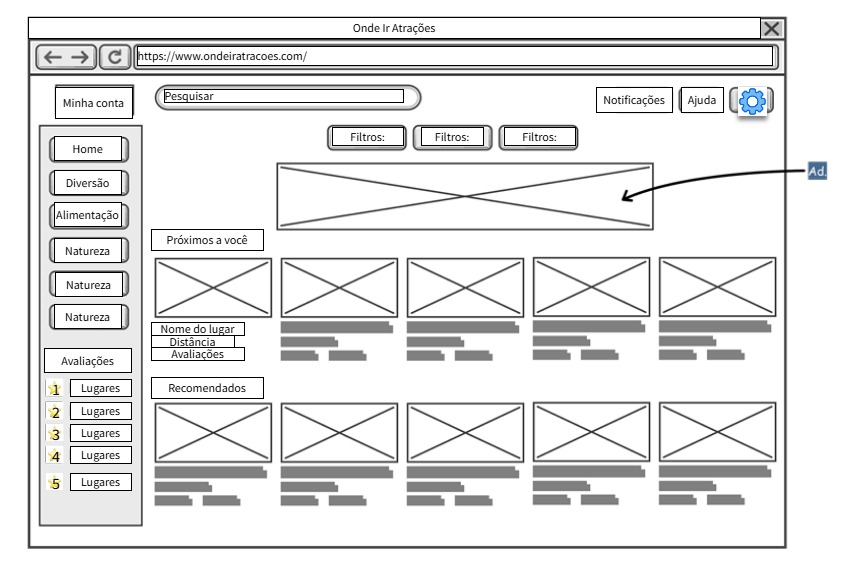

# Trabalho Prático - Semana 03

Dessa vez, vamos escolher uma proposta de projeto para trabalhar.

Nessa atividade, você deverá montar a página inicial do projeto escolhido, a organização do HTML aplicando semântica correta e uso aprimorado do CSS. Leia o enunciado completo no Canvas para mais detalhes.

**IMPORTANTE:** Você deve trabalhar e alterar apenas arquivos dentro da pasta **`public`**. Deixe todos os demais arquivos e pastas desse repositório inalterados. **PRESTE MUITA ATENÇÃO NISSO.**

## Informações Gerais

- Nome: Samuel Henrique Alvarenga e Lopes
- Matricula:  904718
- Proposta de projeto escolhida: Site para atrações de lugarres
- Breve descrição sobre seu projeto: Criei um site, para descorbri atrações de um lugar de acordo com valor, horário de funcionamento,
se é um lugar com ambiente ecológico, ou parques de diversões, escolher entre os melhores avalidos, etc.

## Print do(s) wireframe(s) criado

## Print da home-page criada

<<  COLOQUE A IMAGEM AQUI >>
